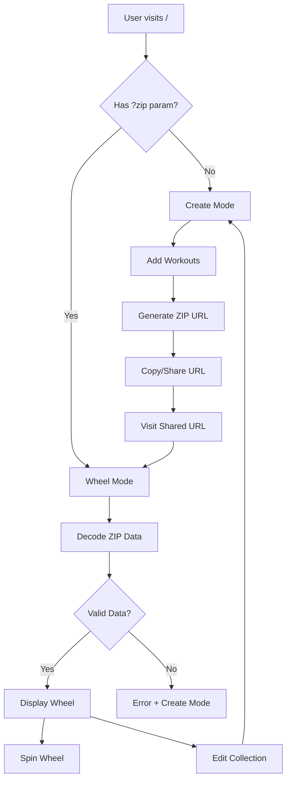

# Zip-File-Loader Feature Design Document

## Purpose

Design a streamlined two-state system that eliminates predefined workout collections in favor of a purely custom, zip-encoded approach where users either create new workout collections or load existing ones from shareable URLs.

## Context & Problem Statement

The current system maintains multiple predefined workout collections (classic, beginner, intermediate, advanced, cardio, strength) alongside a custom creation system. The requirement is to "scrap the current methods of loading the wheel values from some store" and implement a clean two-state approach:

1. **No ZIP data state**: Create wheel mode
2. **ZIP data provided state**: Load and use wheel

## Current Architecture Analysis

### Existing Components
- **Workout Collections**: Predefined collections in `src/utils/workout-collections.ts`
- **Zip Encoding**: Base64 + gzip compression in `src/utils/zip-encoding.ts`
- **Create Route**: Custom wheel creation at `/create`
- **Root Route**: Single entry point handling both create and wheel modes
- **Category Routes**: Individual collection routes (`/beginner`, `/advanced`, etc.)

### Current Data Flow
```
User → Category Route → Predefined Collection → WorkoutDisplayPage
User → Create Route → Custom Collection → Generate ZIP URL
User → ZIP URL → Decode Data → WorkoutDisplayPage (with fallback)
```

## Routing Strategy

### Root Route Approach
The design uses the root route (`/`) as the single entry point for both create and wheel modes. This approach offers several advantages:

- **Intuitive Discovery**: Users naturally navigate to the root to start creating workouts
- **Clean URLs**: Shared URLs look like `/?z=...` (short) rather than `/zip?data=...`
- **Simplified Navigation**: No need to explain or document a separate `/zip` route
- **Better SEO**: Root route gets maximum search engine attention

### Query Parameter Strategy  
The system uses the `zip` query parameter to distinguish between modes:

- **No parameter** (`/`): Create Mode - Users can build custom workout collections
- **With parameter** (`/?zip=...`): Wheel Mode - Displays decoded shared collections

This approach keeps the URL structure clean while making the functionality immediately clear from the parameter name.

## Proposed Solution

### New Two-State Architecture

#### State 1: Create Mode (No ZIP Parameter)
When accessing `/` without a `zip` parameter:
- Display a streamlined workout creation interface
- Allow users to add workouts with multipliers
- Generate shareable ZIP-encoded URLs in real-time
- Provide immediate preview of the wheel

#### State 2: Wheel Mode (ZIP Parameter Present)
When accessing `/?zip=...`:
- Decode and validate the workout collection
- Display the interactive spinning wheel
- Handle decoding errors gracefully
- Maintain existing wheel functionality

### UI/UX Flow Design

#### Create Mode Interface
```
┌─────────────────────────────────────────┐
│ Create Your Workout Wheel               │
├─────────────────────────────────────────┤
│ Collection Title: [________________]    │
│ Description:     [________________]     │
│                                         │
│ Workouts:                              │
│ • [Exercise Name] [1x▼] [+ Remove]     │
│ • [Exercise Name] [2x▼] [+ Remove]     │
│ • [Exercise Name] [1x▼] [+ Remove]     │
│                                         │
│ [+ Add Workout]                        │
│                                         │
│ Share URL: [________________________]  │
│           [Copy] [Test Wheel]          │
└─────────────────────────────────────────┘
```

#### Wheel Mode Interface
```
┌─────────────────────────────────────────┐
│ [Collection Title]                      │
│ [Collection Description]                │
├─────────────────────────────────────────┤
│             🎯                          │
│        ┌─────────────┐                 │
│       ╱               ╲                │
│      ╱     SPINNING    ╲               │
│     ╱       WHEEL       ╲              │
│      ╲                 ╱               │
│       ╲_______________╱                │
│                                         │
│ [SPIN] [Edit] [Share] [New Wheel]      │
└─────────────────────────────────────────┘
```

### Technical Implementation

#### Navigation Structure Update

**Current Navigation (workout-navigation.tsx)**
```typescript
const NAV_ITEMS = [
  { href: "/wheel-of-gains/wheel/classic/", label: "Classic Mix" },
  { href: "/wheel-of-gains/wheel/beginner/", label: "Beginner" },
  { href: "/wheel-of-gains/wheel/intermediate/", label: "Intermediate" },
  { href: "/wheel-of-gains/wheel/advanced/", label: "Advanced" },
  { href: "/wheel-of-gains/wheel/cardio/", label: "Cardio" },
  { href: "/wheel-of-gains/wheel/strength/", label: "Strength" },
];
```

**Proposed Navigation**
```typescript
const NAV_ITEMS = [
  { href: "/wheel-of-gains/", label: "Create Wheel" },
  // Simplified single-entry navigation
  // Additional helpful links could be added:
  // { href: "/wheel-of-gains/help", label: "Help" },
  // { href: "/wheel-of-gains/examples", label: "Examples" },
];
```

#### Route Consolidation
- **Eliminate**: Individual category routes (`/beginner`, `/intermediate`, etc.)
- **Consolidate**: Move `/create` functionality into root (`/`) create mode
- **Simplify**: Root route handles both states based on query parameters

#### Component Architecture
```typescript
// src/routes/index.tsx
export default component$(() => {
  const location = useLocation();
  const encodedData = location.url.searchParams.get("zip");
  
  if (!encodedData) {
    return <CreateWheelMode />;
  }
  
  return <WheelMode encodedData={encodedData} />;
});
```

#### State Management
```typescript
interface CreateModeState {
  title: string;
  description: string;
  workouts: WorkoutInput[];
  shareUrl: string | null;
  isGenerating: boolean;
}

interface WheelModeState {
  collection: EncodedWorkoutCollection | null;
  isLoading: boolean;
  error: string | null;
}
```

### Data Flow Architecture



### Migration Strategy

#### Phase 1: Route Consolidation
- Merge `/create` functionality into root (`/`) create mode
- Update navigation to point to `/` instead of `/create`
- Add redirects from old category routes to `/` create mode

#### Phase 2: Collection Removal
- Remove predefined workout collections
- Remove category route components
- Update main landing page to use root (`/`) create mode

#### Phase 3: Cleanup
- Remove unused workout collection utilities
- Update tests and stories
- Clean up navigation components

### Interface Specifications

#### CreateWheelMode Component
```typescript
interface CreateWheelModeProps {
  // No props - self-contained state management
}

interface WorkoutInput {
  name: string;
  multiplier: number;
  url?: string; // Optional reference URL
}
```

#### WheelMode Component
```typescript
interface WheelModeProps {
  encodedData: string;
}

// Reuses existing WorkoutDisplayPage component
```

### URL Structure

#### Current (Before)
```
/                    → Classic collection
/beginner           → Beginner collection  
/intermediate       → Intermediate collection
/advanced           → Advanced collection
/cardio             → Cardio collection
/strength           → Strength collection
/create             → Custom creation interface
/?zip=...           → Decode shared collection
```

#### Proposed (After)  
```
/                    → Redirect to /zip (create mode)
/zip                 → Create mode (no data parameter)
/zip?z=...          → Wheel mode (decode and display)
```

### Error Handling

#### Create Mode Errors
- Empty title validation
- Minimum workout count validation  
- URL generation failures
- Clipboard copy failures

#### Wheel Mode Errors
- Invalid/corrupted ZIP data
- Malformed workout structure
- Network/decoding failures
- Graceful fallback to create mode

### Accessibility Considerations

- Screen reader support for form inputs
- Keyboard navigation for workout management
- ARIA labels for dynamic content
- Focus management during state transitions

### Performance Considerations

- Lazy loading of non-essential components
- Debounced URL generation during input
- Efficient re-rendering with Qwik signals
- Minimal bundle size impact

## Risks & Assumptions

### Risks
- **User Experience**: Removing predefined collections may confuse existing users
- **SEO Impact**: Consolidating routes may affect search engine indexing
- **Bookmark Breaking**: Existing bookmarks to category routes will break
- **Learning Curve**: Users must now create their own collections

### Mitigation Strategies
- **Onboarding**: Clear instructions and examples in create mode
- **Templates**: Provide template collections users can copy
- **Redirects**: Implement temporary redirects from old routes
- **Documentation**: Update help text and tooltips

### Assumptions  
- Users are willing to create their own workout collections
- The zip encoding/decoding system is reliable and performant
- Mobile users can effectively use the creation interface
- Most usage will shift to shared custom collections

## Success Metrics

### User Experience Metrics
- Time to create first custom collection
- Share URL generation success rate
- Wheel loading performance from shared URLs
- User retention after route consolidation

### Technical Metrics
- Bundle size reduction from removing predefined collections
- Error rates during ZIP encoding/decoding
- Page load performance improvements
- Test coverage maintenance

## Implementation Checklist

### Phase 1: Create Mode Integration
- [ ] Move create functionality into root (`/`) route
- [ ] Implement state detection (zip parameter presence)
- [ ] Update navigation links
- [ ] Test URL generation and sharing

### Phase 2: Wheel Mode Enhancement  
- [ ] Streamline wheel loading from ZIP data
- [ ] Improve error handling and fallbacks
- [ ] Add edit/create new buttons to wheel mode
- [ ] Maintain existing wheel functionality

### Phase 3: Migration & Cleanup
- [ ] Add redirects from old category routes
- [ ] Remove predefined workout collections
- [ ] Update main landing page
- [ ] Clean up unused components and routes

### Phase 4: Testing & Documentation
- [ ] Update component tests and stories
- [ ] Test cross-browser compatibility
- [ ] Update user documentation
- [ ] Performance testing and optimization

## Conclusion

This design consolidates the workout wheel experience into a clean two-state system that prioritizes user-generated content while maintaining the core functionality that makes the application valuable. The approach eliminates complexity around predefined collections while providing a more personalized and shareable experience.

### Key Benefits
- **Simplified User Experience**: Single entry point eliminates confusion between predefined and custom collections
- **Enhanced Sharing**: Every collection is shareable by design, promoting user engagement
- **Reduced Bundle Size**: Elimination of predefined collections reduces JavaScript bundle size
- **Improved Maintainability**: Single route handles all wheel functionality, reducing code duplication
- **Future-Proof Architecture**: User-generated content model scales better than predefined collections

### Implementation Priority
The design prioritizes minimal disruption to existing functionality while achieving maximum user experience improvement. The phased approach ensures that critical wheel functionality remains stable throughout the transition.

### Next Steps
Following approval of this design, the implementation should proceed through the defined phases, with each phase thoroughly tested before proceeding to the next. The success metrics defined will help measure the effectiveness of the transition and guide any necessary adjustments.